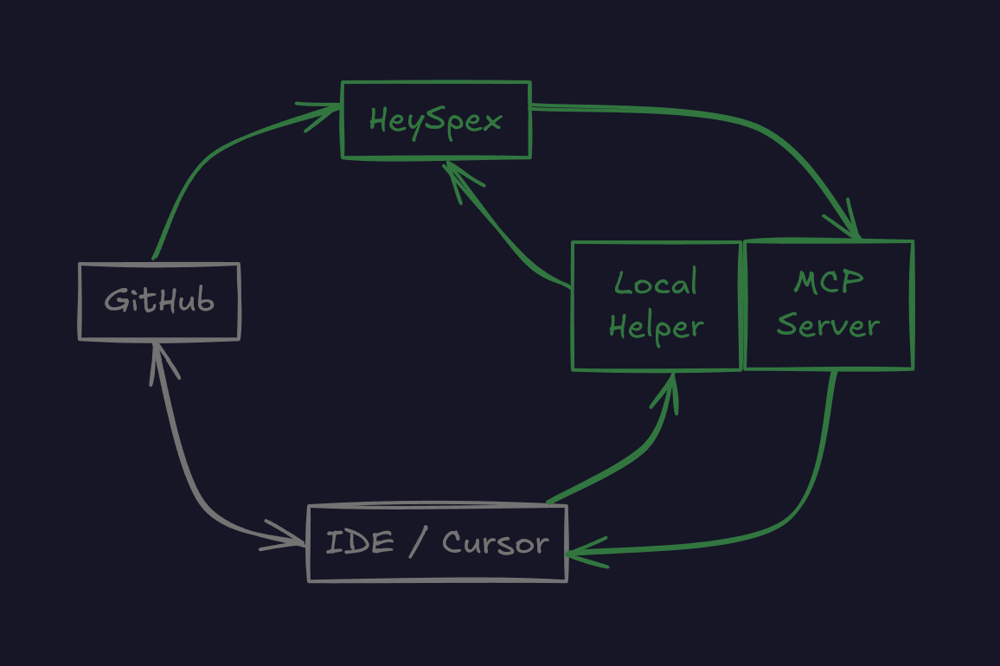

# HeySpex System Overview

## Architecture Diagram

The following diagram illustrates the high-level architecture and data flow of the HeySpex system:

## System Components

### Frontend Application

- **Next.js 13+ App Router**: Modern React framework with server-side rendering
- **Component Architecture**: Organized by feature with shared UI components
- **State Management**: Zustand for client-side state management
- **Styling**: Tailwind CSS with custom design system

### Core Features

- **Issue Management**: Create, track, and manage project issues
- **Team Collaboration**: Multi-team workspace with member management
- **Project Organization**: Hierarchical project structure with health tracking
- **Command Palette**: Global search and navigation system
- **Responsive Layout**: Adaptive UI with resizable panels

### Data Layer

- **Mock Data**: Currently using TypeScript mock data for development
- **Store Management**: Centralized state stores for different domains
- **Type Safety**: Full TypeScript implementation with strict typing

### Development Infrastructure

- **Monorepo Structure**: Single repository with organized service boundaries
- **Component Standards**: Documented patterns and guidelines
- **Testing**: Unit tests and component testing setup
- **Code Quality**: ESLint, Prettier, and Husky for code standards

## Key Design Decisions

1. **Monorepo Architecture**: Chosen for simplified development workflow and shared component reuse
2. **Feature-Based Organization**: Components organized by business domain rather than technical layer
3. **TypeScript-First**: Full type safety across the entire application
4. **Modern React Patterns**: Leveraging latest React features and Next.js capabilities

For detailed architectural decisions, see the [Architecture Decision Records](../adr/).
